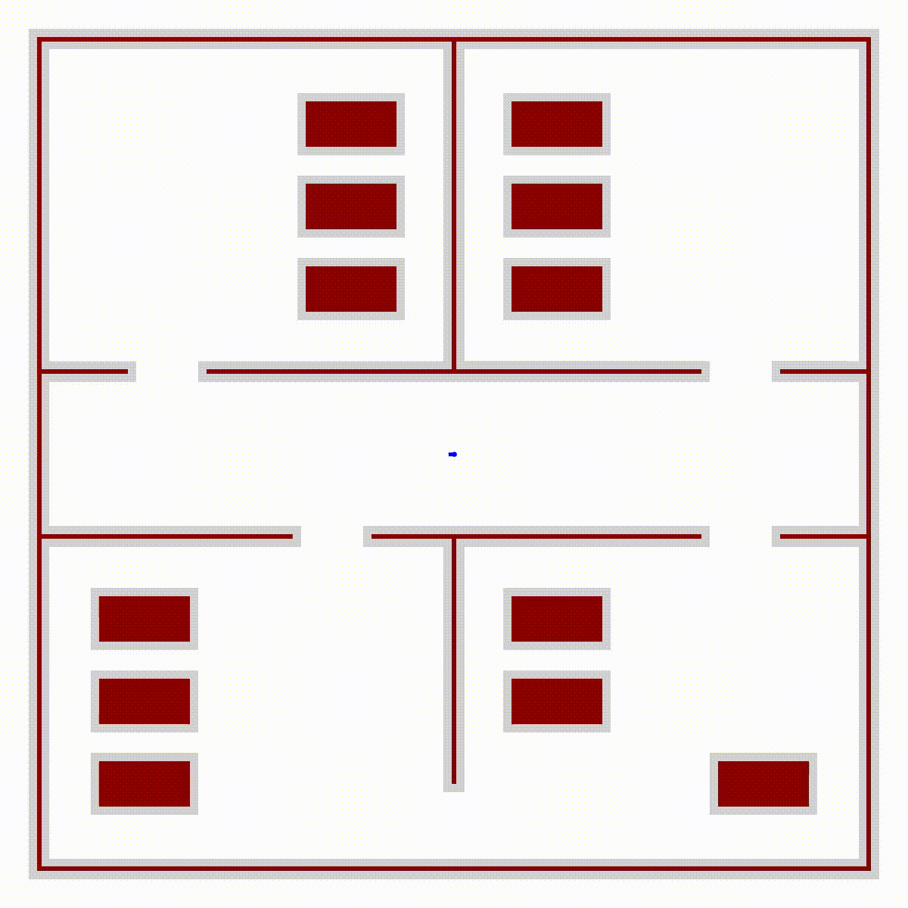

# Application of Automated Guided Vehicles in a Hospital Environment

**Course:** RO47005 - Planning and Decision Making @ TU Delft\
**Group 28**\
Fabio Boekel (4855892)\
Paula Gasco Claramunt (5725453)\
Thomas Hettasch (5836905)\
Kian Heus (4876768)

## Description

<p float="left">


</p>
 
## Dependencies
This repository requires the following python modules to work correctly:
```
numpy
matplotlib
tqdm
mujoco
gym
mujoco-python-viewer
scipy
pillow
pyyaml
```

The dependencies can be installed manually via pip, or using ```
conda env create -f environment.yml```. If conda is used, run ```conda activate group28rrt``` before running the program.

## Installation

To install the program, first clone this repository:
```
git clone git@github.com:kianheus/PDM_Project_Group_28.git
```
Then install the dependencies as outlined above.

 Please also ensure that the relevant python executable runs on a dedicated GPU (if available). If run on the CPU, the simulation will not run realtime.

## Executing program
If using a conda environment, run ```conda activate group28rrt``` first.

To run the main program run the following:
```
cd code
python RRTMain.py
```
*Warning: the program can be slow when running the simulation from the integrated graphics card. Be sure to run the program on the dedicated card.*  

Instruction to interact with environment:
* In first camera view, the mouse can be used to look around the environment.
* Double click car. Hold '**ctrl**' while pressing '**left -**' or '**right mouse button**' to disturb the car. See visualisation below.
* Press '**tab**' to change camera
* Press '**space**' to pause the simulation
* Press '**h**' to open help menu for more options

## External packages/files used
* Gym: https://www.gymlibrary.dev/
* Physics engine: https://mujoco.org/
* MJCF file of a RC car: https://github.com/prl-mushr/mushr_mujoco_ros
    * This package is modified. Only MuSHR RC car is extracted from it and it is put in a custom made hospital environment. Also some small things are added to the car like sensors, colors and camera's.
* Interactive renderer that works and interacts with MuJoCo: https://github.com/rohanpsingh/mujoco-python-viewer
* STL file of hosptial bed: https://grabcad.com/library/hospital-service-room-bed-2-new-version-1 

